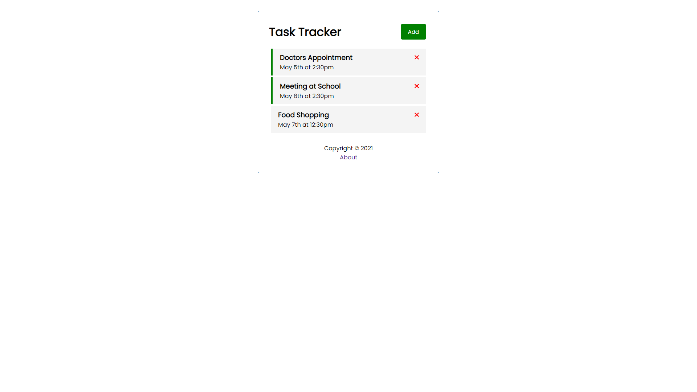

# Description

A simple task tracker based of off Traversy Media's Angular Crash Course video tutorial.

Users can add tasks, delete tasks and set a reminder flag.

HTML | CSS | Javascript | TypeScript | Angular

# Screenshot

# Links

- [Traversy Media Youtube Tutorial](https://youtu.be/3dHNOWTI7H8)

- [Traversy Media Github Code](https://github.com/bradtraversy/angular-crash-2021)
